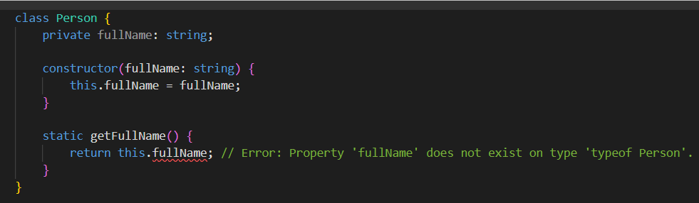

# Static members

- **Static members** là các thuộc tính hoặc phương thức thuộc về lớp (class) chứ không phải đối tượng (instance) của lớp đó. Các thuộc tính và phương thức static có thể truy cập trực tiếp thông qua tên của lớp, không cần phải tạo ra một đối tượng mới.
- Để khai báo một thuộc tính hoặc phương thức là static trong TypeScript, ta sử dụng từ khóa `static` trước tên của nó.
- Khi khai báo một thuộc tính bằng `static` thì sẽ không có hàm khởi tạo **constructor()**
- Ví dụ:

```ts
class MyClass {
  static myStaticProperty = "hello";
  static myStaticMethod() {
    return "world";
  }
}

console.log(MyClass.myStaticProperty); // hello
console.log(MyClass.myStaticMethod()); // world
```

:::note

Ở ví dụ trên, `myStaticProperty` và `myStaticMethod()` là hai thành viên static của lớp `MyClass`. Ta không cần tạo một đối tượng `MyClass` mới để truy cập đến các thành viên static này.

:::

- Trong một **static method** , ta không thể trực tiếp truy cập vào các thuộc tính không phải là `static` của cùng một class. **Static method** chỉ có thể truy cập và thao tác với các thành phần `static` khác trong cùng class, bao gồm các **static property** và **static method** khác.



:::tip

Nếu một class mà có **static method** hay **static property** thì tất cả các thuộc tính, phương thức bên trong class đó cũng nên để là `static`

:::
